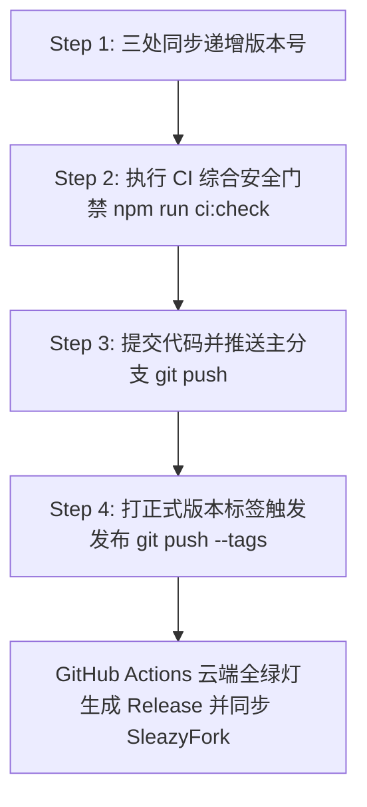

在完成 **Phase 0 到 Phase 5** 的全套工业级现代化重构后，Miss Player 以及今后任何基于 `$modern-userscript` 标准的油猴项目，**日常开发与正式发版流程已经实现了彻底的解耦与安全闭环**。

你可以把今后的流程概括为两个完全独立的场景：
1. **日常开发与测试（敏捷无负担，绝不触发全网发布）**
2. **正式发版（严格经过安全门禁，带标签可审计）**

---

### 一、 日常开发与调试流程（开发期）

在日常开发修 Bug、加新功能时，你无需反复打包、手动复制粘贴代码，也**完全不用担心推送到 GitHub 会意外把未测试的代码推到 SleazyFork 线上**。

#### 1. 启动本地极速开发热更新（HMR）
在项目根目录运行：
```bash
npm run dev
```
* **工作机制**：Vite Dev Server 将在 `http://localhost:5173` 启动（耗时约 200 毫秒）。
* **油猴安装一次**：首次使用时，只需在浏览器访问一次 `http://localhost:5173/__monkey.user.js`（或在油猴扩展中导入 `dist/miss_player.proxy.user.js`）。
* **极速反馈**：后续你在本地编辑保存任何 `.js` 或 `.css`，**浏览器页面秒级局部热重载**，不再需要每次打包后去扩展管理页面点更新。

#### 2. 日常代码提交（推送到 GitHub）
开发完成一个阶段，需要备份或共享代码时：
```bash
git add .
git commit -m "feat: 新增某某特性"
git push origin main
```
* **重要保障**：此时 GitHub 云端只会自动运行 CI 质量检测（确保代码无语法错误、无隐蔽 Bug），**但绝对不会通知 SleazyFork 发布新版本**，你的线上用户依然运行在稳定的正式版中。

---

### 二、 正式发布全流程（发版期：标准四步法）

当经过充分测试，决定对外发布一个正式版本（例如从 `v5.6.21` 升级至 `v5.6.22`）时，严格遵循以下四步：



#### Step 1: 三处同步版本号 (Version Bump)
严格遵循项目核心红线，同步递增版本号：
1. `package.json` -> `"version": "5.6.22"`
2. `webpack.config.js` -> `version: '5.6.22'`
3. `src/telemetry/EventCollector.js` & `src/sync/SyncManager.js` -> fallback `'5.6.22'`

#### Step 2: 执行自动化合规门禁核验 (一键把关)
在本地终端执行刚才落成的自动化门禁命令：
```bash
npm run ci:check
```
该命令会自动串联以下四道防线：
* **[1/4] 版本强同步核验**：确保上面几处版本号分毫不差；
* **[2/4] 生产构建**：执行 Vite 打包（0.7 秒产出全新 `dist/`）；
* **[3/4] 平台合规审查**：自动扫描有无敏感域名、体积是否突破 1.8 MB、严格模式语法分号是否完好；
* **[4/4] 无头沙箱仿真测试**：在隔离 VM 中跑一遍启动逻辑，确保零语法或未定义报错。
> 💡 只有控制台打出 `🎉 所有 CI 检查项 100% 通过`，才代表这批代码符合工业级发布标准。

#### Step 3: 提交代码并推送
```bash
git add -A
git commit -m "release: 发布 v5.6.22 优化某某功能并更新构建产物"
git push origin main
```

#### Step 4: 打版本标签触发正式发版 (Release Tag)
在本地终端输入以下命令：
```bash
git tag v5.6.22
git push origin v5.6.22
```
* **云端流水线激活**：
  1. GitHub 检测到 `v*` 标签推送，立即激活 `.github/workflows/ci-release.yml`；
  2. 云端 Linux 容器再次进行独立环境的完整构建与合规校验；
  3. 校验通过后，自动在 GitHub 生成对应的 Release 页面并附带正式的脚本产物（`miss_player.user.js`、`miss_player.meta.js`）；
  4. SleazyFork/GreasyFork 检测到正式 Release 后，无缝将新版本推送到全网用户的油猴脚本管理器中。

---

### 三、 应急危机处理 SOP（如果收到平台举报或问询）

若未来遇到任何形式的社区反馈、差评或管理员问询，牢记以下铁则：
1. **不要在申诉区先写小作文争辩**（技术社区只看代码事实，解释动机只会被视作推卸责任）；
2. 本地按照规则修改代码，运行 `npm run ci:check` 验证通过；
3. 按照标准流程递增版本号并执行 `git tag` 发版推送；
4. 携带全新的版本号和清晰的 Commit 记录，前往申诉区以清晰客观的英文陈述整改动作，礼貌申请结案。

这套体系兼顾了**日常开发无拘无束的高效率**与**正式发版坚如磐石的安全性**，今后无论由你本人开发还是交由 AI Agent 迭代，都能保持长期健康运行。