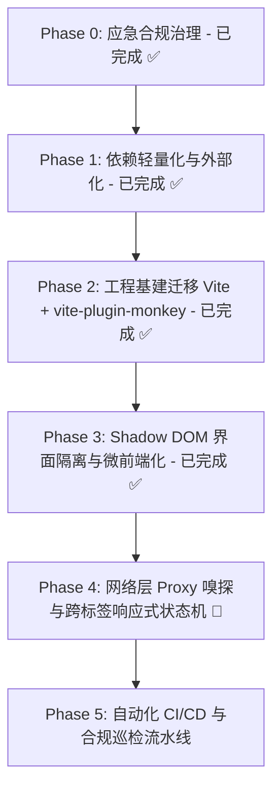

# Miss Player 现代化演进与工程重构计划 (TODO.md)

> 本文档用于记录、监控与推动 **Miss Player** 向现代油猴（Userscript）微前端架构演进的实施进度。所有重构推进必须严格遵循 [AGENTS.md](./AGENTS.md) 中的合规红线与 [GreasyFork&sleazyfork_rules.md](./GreasyFork&sleazyfork_rules.md) 审查准则。

---

## 📊 演进路线全景图

---

## 🎯 任务清单与进度监控

### Phase 0: 应急合规治理与审查消警 (已达成 ✅)
- [x] **下线遥测追踪**：彻底移除 `EventCollector.js` 内部指纹采集、视频观看打点及网络上报，清除历史客户端 ID 缓存。
- [x] **撤除回传端点**：从 `@connect` 元数据及源码中永久剔除 `telemetry.x-flow.ccwu.cc` 与 workers 域名。
- [x] **关闭 Terser 混淆**：配置 `mangle: false`，保留全部有意义变量名与函数结构，满足透明审计要求。
- [x] **消灭低版本降级垫片**：升级 Babel 编译目标为现代浏览器（Chrome 90+ / Safari 14+），产物体积由 1.33 MiB 缩减至 850 KiB。
- [x] **建立平台合规准则**：落成 `GreasyFork&sleazyfork_rules.md` 并在 `AGENTS.md` 中建立硬性约束。
- [x] **完成 SleazyFork 申诉结案**：举报 #95279 经管理员核验正式标记为解决，原讨论帖同步发布公开声明。

---

### Phase 1: 依赖轻量化与审查脱敏 (已达成 ✅ 零运行时外部依赖)
> **目标**：彻底审查并剔除所有不必要的第三方运行时依赖包，业务代码实现 100% 自包含与零冗余。

- [x] **1.1 Hls.js 依赖归属审计**
  - [x] 审计全源码确认 Miss Player 架构采用直接劫持宿主已有 `<video>` 元素，播放器本身无需打包 `Hls.js`；
  - [x] 清理 `package.json` 中历史遗留的 `hls.js` 依赖项。
- [x] **1.2 触控音效原生 Web Audio 重构**
  - [x] 评估并移除 `@web-kits/audio` 全量合成器库（消除 1,500+ 行冗余音频工具代码）；
  - [x] 移除 `.web-kits/` 临时目录及预设配置文件；
  - [x] 使用原生 Web Audio API 重写 `src/utils/sound.js`，高保真还原 1200Hz 正弦波 Tap 触控反馈。
- [x] **1.3 零运行时外部依赖达成**
  - [x] `package.json` 中 `dependencies` 清零，打包产物体积优化至 810 KiB（全量纯业务逻辑，无任何第三方 minified 碎片）；
  - [x] Webpack 构建耗时从 10.7 秒大幅缩短至 2.6 秒。

---

### Phase 2: 工程底座现代化迁移 (已达成 ✅ Vite + vite-plugin-monkey)
> **目标**：彻底告别臃肿的 Webpack 5 + Babel 流水线，拥抱现代前端标准，享受真正的本地热更新 (HMR) 调试体验。

- [x] **2.1 双轨并行脚手架搭建**
  - [x] 引入 `vite` 与 `vite-plugin-monkey`，落成 `vite.config.mjs`（保留 `npm run build:webpack` 双轨支持）；
  - [x] 配置 `vite-plugin-monkey` 中的 `userscript` 元数据（严格遵循 `loadingi.local` 命名空间与多语言映射规范）；
  - [x] 配置 `build.minify = false` 与 `target: 'es2020'`，确保输出透明、可读且满足合规审查。
- [x] **2.2 本地极速开发与 HMR 就绪**
  - [x] `npm run dev` 启动 Vite Dev Server，提供 `__monkey.user.js` 实时热代理，免去反复重装脚本调试；
  - [x] 统一全量 CSS 导入规范为标准 ESM 静态引用。
- [x] **2.3 权限与依赖智能推导**
  - [x] 启用 AST 级 `@grant` 扫描推导，精准覆盖所调用 GM API；
  - [x] 严密锁定 `@connect` 白名单。
- [x] **2.4 构建效率与产物体积跨越式提升**
  - [x] 构建耗时由 2.6 秒暴降至 **760 毫秒**（相较于早期 10.7 秒提速超 14 倍）；
  - [x] 产物体积维持在 780 KiB 左右（内联包含全部样式，无外链延迟）。

---

### Phase 3: 界面微前端化与样式强隔离 (已达成 ✅ Shadow DOM)
> **目标**：摆脱与宿主网站的“CSS 军备竞赛”，根治样式穿透、`!important` 权重大战与层级污染。

- [x] **3.1 自定义 Web Component 封装**
  - [x] 注册原生自定义元素 `<miss-player-root>`，挂载 `attachShadow({ mode: 'open' })`；
  - [x] 采用 `display: contents !important;` 作为透明无盒模型的视窗挂载边界；
  - [x] 将背景遮罩（`.tm-video-overlay`）、主容器（`.tm-player-container`）、控制栏与评论侧栏封装在 Shadow Root 内部。
- [x] **3.2 `adoptedStyleSheets` 强隔离样式注入**
  - [x] 通过 `import playerStyles from './style.css?inline'` 极速直取编译后纯样式文本；
  - [x] 优先采用现代浏览器原生 `adoptedStyleSheets` 接口注入样式表，并自动提供 `<style>` 标签平滑降级；
  - [x] 样式表中在 `:root` 基础上全面扩展 `:host`，让深色模式设计规范与全局 CSS 变量完美通达组件内部。
- [x] **3.3 彻底根治样式双向污染**
  - [x] 宿主原网页无论如何设置全局 `box-sizing`、`margin`、`!important` 样式，均无法穿透破坏播放器布局；
  - [x] 播放器自身的深色毛玻璃材质与自定义输入框排版永不溢出污染原网页。
- [x] **3.4 生命周期与手势穿透闭环**
  - [x] 退出播放器时无缝将 `<video>` 归还给原网页真实 DOM，同步从 `document.body` 移除 `<miss-player-root>` 宿主；
  - [x] 适配 `.controls-hidden` 在 Shadow DOM 宿主层面的类名传播，全屏与手势交互平稳运行。

---

### Phase 4: 网络层底层嗅探与响应式跨标签状态机 🎯 下一步重点
> **目标**：由“脆弱的 DOM 抓取”向“底层网络拦截”演进，构建无后端的跨标签页实时同步能力。

- [ ] **4.1 原生 Fetch / XHR 原型链 Proxy 劫持**
  - [ ] 在 `@run-at document-start` 阶段安全劫持目标站点的 API 请求与响应；
  - [ ] 直接从网络层响应拦截解析 m3u8 播放地址与高清视频元数据，取代 DOM 正则提取；
  - [ ] 建立沙箱防御机制，杜绝原型链污染并防止宿主页面脚本窥探特权操作。
- [ ] **4.2 基于 `GM_addValueChangeListener` 的响应式 Store**
  - [ ] 引入 Nano Stores / Zustand 风格轻量状态机，桥接油猴跨域存储；
  - [ ] 实现多标签页之间的播放进度无缝接力、播放器全局配置秒级热同步；
  - [ ] A-B 打点切片、本地收藏夹在多个页面之间实时增量响应。
- [ ] **4.3 本地离线高阶持久化 (IndexedDB)**
  - [ ] 针对高频打点、大批量评论离线缓存接入 `IndexedDB`，彻底解除单 key 存储容量限制。

---

### Phase 5: 自动化 CI/CD 与合规巡检流水线
> **目标**：打造工业级发版防御屏障，杜绝任何违规代码再次流入生产发布区。

- [ ] **5.1 本地静态合规 Linter**
  - [ ] 编写 AST 检查脚本：自动扫描打包产物，若检测到代码混淆、单字母变量密集区或未注明的外部连接，直接阻断构建；
  - [ ] 校验体积预算：构建产物超过 1.0 MB 触发黄色告警，超过 1.8 MB 强制构建失败。
- [ ] **5.2 Playwright 真实扩展端到端自动化测试**
  - [ ] 搭建无头浏览器加载 Tampermonkey 扩展的 E2E 自动化测试，覆盖 MissAV / Jable 核心播放流程；
  - [ ] 校验各站点广告拦截与 DOM 渲染稳定性。
- [ ] **5.3 GitHub Actions 自动发版与分发**
  - [ ] 配置 Release Tag 触发自动构建、测试与版本发布；
  - [ ] 自动同步至 SleazyFork / GreasyFork 并生成带有详细 Diff 说明的 Release Notes。

---

## 📌 执行纪律与红线备忘 (Quick Reference)

1. **绝对主键保护**：任何重构无论怎样变动，`@namespace: loadingi.local` 与主名称绝对不可变动。
2. **版本三处同步**：`package.json`、构建脚本配置、内部 fallback 版本字符串永远严格同步。
3. **安全透明优先**：构建产物必须保持可读，严禁为了盲目追求体积开启代码混淆 (No Mangle)。
