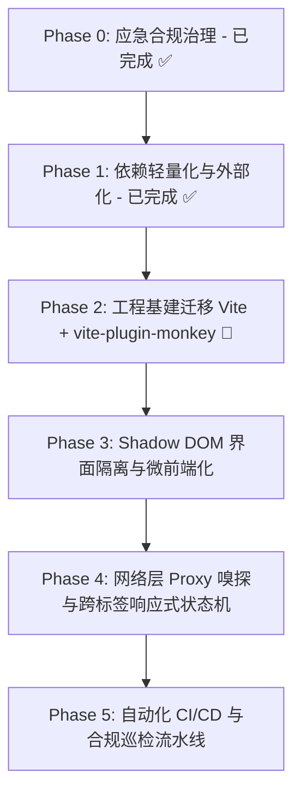

# Miss Player 现代化演进与工程重构计划 (TODO.md)

> 本文档用于记录、监控与推动 **Miss Player** 向现代油猴（Userscript）微前端架构演进的实施进度。所有重构推进必须严格遵循 [AGENTS.md](./AGENTS.md) 中的合规红线与 [GreasyFork&sleazyfork_rules.md](./GreasyFork&sleazyfork_rules.md) 审查准则。

---

## 📊 演进路线全景图

---

## 🎯 任务清单与进度监控

### Phase 0: 应急合规治理与审查消警 (已达成 ✅)
- [x] **下线遥测追踪**：彻底移除 `EventCollector.js` 内部指纹采集、视频观看打点及网络上报，清除历史客户端 ID 缓存。
- [x] **撤除回传端点**：从 `@connect` 元数据及源码中永久剔除 `telemetry.x-flow.ccwu.cc` 与 workers 域名。
- [x] **关闭 Terser 混淆**：配置 `mangle: false`，保留全部有意义变量名与函数结构，满足透明审计要求。
- [x] **消灭低版本降级垫片**：升级 Babel 编译目标为现代浏览器（Chrome 90+ / Safari 14+），产物体积由 1.33 MiB 缩减至 850 KiB。
- [x] **建立平台合规准则**：落成 `GreasyFork&sleazyfork_rules.md` 并在 `AGENTS.md` 中建立硬性约束。
- [x] **完成 SleazyFork 申诉结案**：举报 #95279 经管理员核验正式标记为解决，原讨论帖同步发布公开声明。

---

### Phase 1: 依赖轻量化与审查脱敏 (已达成 ✅ 零运行时外部依赖)
> **目标**：彻底审查并剔除所有不必要的第三方运行时依赖包，业务代码实现 100% 自包含与零冗余。

- [x] **1.1 Hls.js 依赖归属审计**
  - [x] 审计全源码确认 Miss Player 架构采用直接劫持宿主已有 `<video>` 元素，播放器本身无需打包 `Hls.js`；
  - [x] 清理 `package.json` 中历史遗留的 `hls.js` 依赖项。
- [x] **1.2 触控音效原生 Web Audio 重构**
  - [x] 评估并移除 `@web-kits/audio` 全量合成器库（消除 1,500+ 行冗余音频工具代码）；
  - [x] 移除 `.web-kits/` 临时目录及预设配置文件；
  - [x] 使用原生 Web Audio API 重写 `src/utils/sound.js`，高保真还原 1200Hz 正弦波 Tap 触控反馈。
- [x] **1.3 零运行时外部依赖达成**
  - [x] `package.json` 中 `dependencies` 清零，打包产物体积优化至 810 KiB（全量纯业务逻辑，无任何第三方 minified 碎片）；
  - [x] Webpack 构建耗时从 10.7 秒大幅缩短至 2.6 秒。

---

### Phase 2: 工程底座现代化迁移 (Vite + `vite-plugin-monkey`) 🎯 下一步重点
> **目标**：彻底告别臃肿的 Webpack 5 + Babel 流水线，拥抱现代前端标准，享受真正的本地热更新 (HMR) 调试体验。

- [ ] **2.1 双轨并行脚手架搭建**
  - [ ] 引入 `vite` 与 `vite-plugin-monkey`，新建 `vite.config.mjs`（与现有 webpack 并行开发）；
  - [ ] 配置 `vite-plugin-monkey` 中的 `userscript` 元数据（严格遵循 `loadingi.local` 命名空间与红线）；
  - [ ] 配置 `build.minify = false` 与 Rollup `output.compact = false`，确保输出透明、可读。
- [ ] **2.2 本地极速开发与 HMR 验证**
  - [ ] 配置本地 Dev Server 热更新代理脚本，实现修改源文件无需重新打包安装即可即时生效；
  - [ ] 验证 CSS 热重载与组件状态局部替换。
- [ ] **2.3 权限与依赖智能推导**
  - [ ] 启用 AST 级 `@grant` 与 `@connect` 自动化推导，杜绝权限遗漏与越权声明；
  - [ ] 使用 `externalGlobals` 优雅管理第三方 CDN 依赖。
- [ ] **2.4 废弃 Webpack 依赖**
  - [ ] 在双轨验证 100% 通过后，归档并安全移除 `webpack`、`babel`、`terser` 相关配置文件与包依赖。

---

### Phase 3: 界面微前端化与样式强隔离 (Shadow DOM)
> **目标**：摆脱与宿主网站的“CSS 军备竞赛”，根治样式穿透、`!important` 权重大战与层级污染。

- [ ] **3.1 自定义 Web Component 封装**
  - [ ] 注册原生自定义元素 `<miss-player-root>`，挂载 `attachShadow({ mode: 'open' })`；
  - [ ] 将控制面板、底部进度条、A-B 循环面板和评论侧边栏封装在 Shadow Root 内部。
- [ ] **3.2 `adoptedStyleSheets` 样式隔离加载**
  - [ ] 改造 CSS 构建流水线，将样式直接注入为 Shadow Root 的 `adoptedStyleSheets`；
  - [ ] 彻底清理业务 CSS 中的全局降级选择器与防穿透补丁，精简样式规则。
- [ ] **3.3 事件冒泡与手势边界重构**
  - [ ] 调整横向滚动与垂直滑动的手势委托边界，防止触摸事件意外冒泡滚动底层原网页；
  - [ ] 全屏模式（Full Screen API）在 Shadow DOM 内部元素的跨浏览器兼容性适配。

---

### Phase 4: 网络层底层嗅探与响应式跨标签状态机
> **目标**：由“脆弱的 DOM 抓取”向“底层网络拦截”演进，构建无后端的跨标签页实时同步能力。

- [ ] **4.1 原生 Fetch / XHR 原型链 Proxy 劫持**
  - [ ] 在 `@run-at document-start` 阶段安全劫持目标站点的 API 请求与响应；
  - [ ] 直接从网络层响应拦截解析 m3u8 播放地址与高清视频元数据，取代 DOM 正则提取；
  - [ ] 建立沙箱防御机制，杜绝原型链污染并防止宿主页面脚本窥探特权操作。
- [ ] **4.2 基于 `GM_addValueChangeListener` 的响应式 Store**
  - [ ] 引入 Nano Stores / Zustand 风格轻量状态机，桥接油猴跨域存储；
  - [ ] 实现多标签页之间的播放进度无缝接力、播放器全局配置秒级热同步；
  - [ ] A-B 打点切片、本地收藏夹在多个页面之间实时增量响应。
- [ ] **4.3 本地离线高阶持久化 (IndexedDB)**
  - [ ] 针对高频打点、大批量评论离线缓存接入 `IndexedDB`，彻底解除单 key 存储容量限制。

---

### Phase 5: 自动化 CI/CD 与合规巡检流水线
> **目标**：打造工业级发版防御屏障，杜绝任何违规代码再次流入生产发布区。

- [ ] **5.1 本地静态合规 Linter**
  - [ ] 编写 AST 检查脚本：自动扫描打包产物，若检测到代码混淆、单字母变量密集区或未注明的外部连接，直接阻断构建；
  - [ ] 校验体积预算：构建产物超过 1.0 MB 触发黄色告警，超过 1.8 MB 强制构建失败。
- [ ] **5.2 Playwright 真实扩展端到端自动化测试**
  - [ ] 搭建无头浏览器加载 Tampermonkey 扩展的 E2E 自动化测试，覆盖 MissAV / Jable 核心播放流程；
  - [ ] 校验各站点广告拦截与 DOM 渲染稳定性。
- [ ] **5.3 GitHub Actions 自动发版与分发**
  - [ ] 配置 Release Tag 触发自动构建、测试与版本发布；
  - [ ] 自动同步至 SleazyFork / GreasyFork 并生成带有详细 Diff 说明的 Release Notes。

---

## 📌 执行纪律与红线备忘 (Quick Reference)

1. **绝对主键保护**：任何重构无论怎样变动，`@namespace: loadingi.local` 与主名称绝对不可变动。
2. **版本三处同步**：`package.json`、构建脚本配置、内部 fallback 版本字符串永远严格同步。
3. **安全透明优先**：构建产物必须保持可读，严禁为了盲目追求体积开启代码混淆 (No Mangle)。
