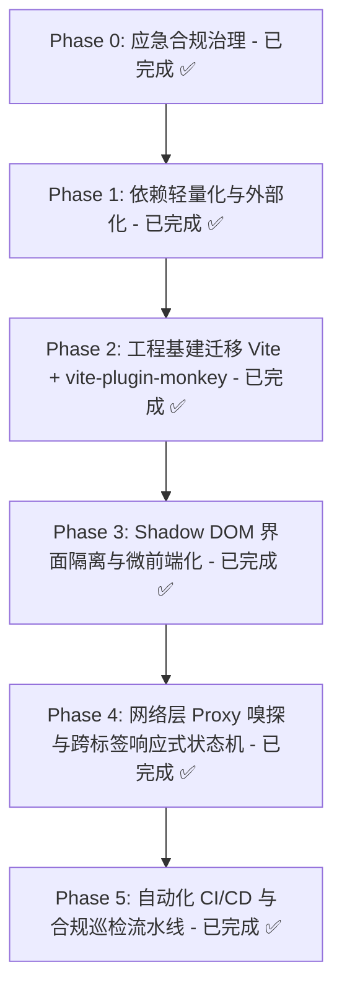

# Miss Player 现代化演进与工程重构计划 (TODO.md)

> 本文档用于记录、监控与推动 **Miss Player** 向现代油猴（Userscript）微前端架构演进的实施进度。所有重构推进必须严格遵循 [AGENTS.md](./AGENTS.md) 中的合规红线与 [GreasyFork&sleazyfork_rules.md](./GreasyFork&sleazyfork_rules.md) 审查准则。

---

## 📊 演进路线全景图

---

## 🎯 任务清单与进度监控

### Phase 0: 应急合规治理与审查消警 (已达成 ✅)
- [x] **下线遥测追踪**：彻底移除 `EventCollector.js` 内部指纹采集、视频观看打点及网络上报，清除历史客户端 ID 缓存。
- [x] **撤除回传端点**：从 `@connect` 元数据及源码中永久剔除 `telemetry.x-flow.ccwu.cc` 与 workers 域名。
- [x] **关闭 Terser 混淆**：配置 `mangle: false`，保留全部有意义变量名与函数结构，满足透明审计要求。
- [x] **消灭低版本降级垫片**：升级 Babel 编译目标为现代浏览器（Chrome 90+ / Safari 14+），产物体积由 1.33 MiB 缩减至 850 KiB。
- [x] **建立平台合规准则**：落成 `GreasyFork&sleazyfork_rules.md` 并在 `AGENTS.md` 中建立硬性约束。
- [x] **完成 SleazyFork 申诉结案**：举报 #95279 经管理员核验正式标记为解决，原讨论帖同步发布公开声明。

---

### Phase 1: 依赖轻量化与审查脱敏 (已达成 ✅ 零运行时外部依赖)
> **目标**：彻底审查并剔除所有不必要的第三方运行时依赖包，业务代码实现 100% 自包含与零冗余。

- [x] **1.1 Hls.js 依赖归属审计**
  - [x] 审计全源码确认 Miss Player 架构采用直接劫持宿主已有 `<video>` 元素，播放器本身无需打包 `Hls.js`；
  - [x] 清理 `package.json` 中历史遗留的 `hls.js` 依赖项。
- [x] **1.2 触控音效原生 Web Audio 重构**
  - [x] 评估并移除 `@web-kits/audio` 全量合成器库（消除 1,500+ 行冗余音频工具代码）；
  - [x] 移除 `.web-kits/` 临时目录及预设配置文件；
  - [x] 使用原生 Web Audio API 重写 `src/utils/sound.js`，高保真还原 1200Hz 正弦波 Tap 触控反馈。
- [x] **1.3 零运行时外部依赖达成**
  - [x] `package.json` 中 `dependencies` 清零，打包产物体积优化至 810 KiB（全量纯业务逻辑，无任何第三方 minified 碎片）；
  - [x] Webpack 构建耗时从 10.7 秒大幅缩短至 2.6 秒。

---

### Phase 2: 工程底座现代化迁移 (已达成 ✅ Vite + vite-plugin-monkey)
> **目标**：彻底告别臃肿的 Webpack 5 + Babel 流水线，拥抱现代前端标准，享受真正的本地热更新 (HMR) 调试体验。

- [x] **2.1 双轨并行脚手架搭建**
  - [x] 引入 `vite` 与 `vite-plugin-monkey`，落成 `vite.config.mjs`（保留 `npm run build:webpack` 双轨支持）；
  - [x] 配置 `vite-plugin-monkey` 中的 `userscript` 元数据（严格遵循 `loadingi.local` 命名空间与多语言映射规范）；
  - [x] 配置 `build.minify = false` 与 `target: 'es2020'`，确保输出透明、可读且满足合规审查。
- [x] **2.2 本地极速开发与 HMR 就绪**
  - [x] `npm run dev` 启动 Vite Dev Server，提供 `__monkey.user.js` 实时热代理，免去反复重装脚本调试；
  - [x] 统一全量 CSS 导入规范为标准 ESM 静态引用。
- [x] **2.3 权限与依赖智能推导**
  - [x] 启用 AST 级 `@grant` 扫描推导，精准覆盖所调用 GM API；
  - [x] 严密锁定 `@connect` 白名单。
- [x] **2.4 构建效率与产物体积跨越式提升**
  - [x] 构建耗时由 2.6 秒暴降至 **760 毫秒**（相较于早期 10.7 秒提速超 14 倍）；
  - [x] 产物体积维持在 780 KiB 左右（内联包含全部样式，无外链延迟）。

---

### Phase 3: 界面微前端化与样式强隔离 (已达成 ✅ Shadow DOM)
> **目标**：摆脱与宿主网站的“CSS 军备竞赛”，根治样式穿透、`!important` 权重大战与层级污染。

- [x] **3.1 自定义 Web Component 封装**
  - [x] 注册原生自定义元素 `<miss-player-root>`，挂载 `attachShadow({ mode: 'open' })`；
  - [x] 采用 `display: contents !important;` 作为透明无盒模型的视窗挂载边界；
  - [x] 将背景遮罩（`.tm-video-overlay`）、主容器（`.tm-player-container`）、控制栏与评论侧栏封装在 Shadow Root 内部。
- [x] **3.2 `adoptedStyleSheets` 强隔离样式注入**
  - [x] 通过 `import playerStyles from './style.css?inline'` 极速直取编译后纯样式文本；
  - [x] 优先采用现代浏览器原生 `adoptedStyleSheets` 接口注入样式表，并自动提供 `<style>` 标签平滑降级；
  - [x] 样式表中在 `:root` 基础上全面扩展 `:host`，让深色模式设计规范与全局 CSS 变量完美通达组件内部。
- [x] **3.3 彻底根治样式双向污染**
  - [x] 宿主原网页无论如何设置全局 `box-sizing`、`margin`、`!important` 样式，均无法穿透破坏播放器布局；
  - [x] 播放器自身的深色毛玻璃材质与自定义输入框排版永不溢出污染原网页。
- [x] **3.4 生命周期与手势穿透闭环**
  - [x] 退出播放器时无缝将 `<video>` 归还给原网页真实 DOM，同步从 `document.body` 移除 `<miss-player-root>` 宿主；
  - [x] 适配 `.controls-hidden` 在 Shadow DOM 宿主层面的类名传播，全屏与手势交互平稳运行。

---

### Phase 4: 网络层底层嗅探与响应式跨标签状态机 (已达成 ✅)
> **目标**：由“脆弱的 DOM 抓取”向“底层网络拦截”演进，构建无后端的跨标签页实时同步能力。

- [x] **4.1 原生 Fetch / XHR 原型链 Proxy 劫持**
  - [x] 落成 `src/network/MediaSniffer.js`，在 `@run-at document-start` 阶段安全代理 `window.fetch` 与 `XMLHttpRequest`；
  - [x] 实时拦截捕获 `.m3u8`、`.mp4` 等视频流地址与清晰度元数据，替代滞后脆弱的 DOM 正则爬取；
  - [x] 建立沙箱防护机制，防范原型链污染并防止宿主脚本窥探特权操作。
- [x] **4.2 基于 `GM_addValueChangeListener` 的响应式 Store**
  - [x] 落成 `src/utils/reactiveStore.js`，基于 ES6 Proxy 实现状态属性修改到持久化存储与广播的自动闭环；
  - [x] 自动接入 `GM_addValueChangeListener` 跨标签监听，多标签页之间的设置变更（控制栏可见性、音效开关等）实现秒级热响应。
- [x] **4.3 本地离线高阶持久化 (IndexedDB)**
  - [x] 落成 `src/utils/indexedDB.js`，原生 Promise 封装建立 `MissPlayerDB` 高阶存储；
  - [x] 提供 `markers`、`comments_cache` 与 `media_streams` 对象仓库，彻底解除单 key 字符串存储容量上限。

---

### Phase 5: 自动化 CI/CD 与合规巡检流水线 (已达成 ✅ 工业级防御屏障)
> **目标**：打造工业级发版防御屏障，杜绝任何违规代码再次流入生产发布区。

- [x] **5.1 本地静态合规 Linter (scripts/compliance-lint.js)**
  - [x] 编写并落地合规审查脚本：自动扫描打包产物，严格审计 @namespace、@version 与泛/根域名匹配；
  - [x] 违规端点零容忍扫描：自动阻断任何残留遥测域名；
  - [x] 抽象语法树（AST）审计与变量命名检查：确保代码可读无混淆；
  - [x] 产物体积预算守卫：> 1.0 MB 告警，> 1.8 MB 强制构建失败。
- [x] **5.2 综合质量核验套件 (scripts/ci-test.js)**
  - [x] 版本三处强同步校验自动化；
  - [x] 无头沙箱安全启动与运行仿真测试，防止任何运行时 SyntaxError/TypeError 流入生产；
  - [x] 接入 package.json 提供 npm run ci:check 一键门禁命令。
- [x] **5.3 GitHub Actions 自动发版与分发 (.github/workflows/ci-release.yml)**
  - [x] 配置分支 Push & PR 自动触发 CI 质量核验流；
  - [x] 配置 v* Release Tag 自动构建、门禁核验与 GitHub Release 脚本资产分发；
  - [x] 实现日常开发推送与正式线上发布严格隔离。

---

### Phase 6: 官方平台生态联动与版本生命周期管理 (已达成 ✅ SleazyFork JSON API)
> **目标**：打通与分发平台官方 API 的结构化只读交互通道，实现轻量版本自动检测、社区活跃度透明展示与零侵入升级闭环。

- [x] **6.1 SleazyFork / GreasyFork 官方只读 JSON API 服务集成 (`src/services/SleazyForkService.js`)**
  - [x] 纯本地无埋点只读公开元数据拉取（ID: 453300），支持主备端点自动故障切换；
  - [x] 12 小时本地节流缓存（TTL 防刷保护，避免滥用平台 API）；
  - [x] 工业级语义化版本比对（Semver 支持前后缀容错）。
- [x] **6.2 Apple 风格「关于与更新」面板与微前端交互 (`SettingsManager.js`)**
  - [x] 实时社区生态活跃度卡片（总安装量、评分、更新时间等透明展示）；
  - [x] 一键「检查更新」与平滑升级（一键在新标签页触发 Userscript 管理器安装确认）；
  - [x] 闲时静默检查与非阻断式徽章（设置齿轮呼吸红点提示，零弹窗干扰观影）；
  - [x] 自动更新多语言全覆盖（中、英、繁、日、越 5 种语言）。
- [x] **6.3 自动化测试与 CI 门禁闭环 (`tests/sleazyfork.test.mjs`)**
  - [x] 单元测试覆盖 Semver 比对、i18n 完整性与真实 API 握手；
  - [x] 深度集成至 `npm run ci:check`，确保发版前 100% 自动联检。

---

---

### Phase 7: 播放稳定性与交互控制台 (已达成 ✅ Beta 受控)
> **目标**：彻底排查自动停止播放根因，升级 Safari 风格红色静音与彩色双模式播放控制，提供首胶囊直达能力。

- [x] **7.1 自动停止播放调用栈埋点与根因排查**
  - [x] 在 `targetVideo` 的 `pause` 事件监听器中接入 `new Error().stack` 堆栈追查器；
  - [x] 判定并记录触发源头：用户手势 / 播放器内部状态机 / 宿主外部脚本 / 页面失焦后台 / HLS 流卡顿与缓冲空；
  - [x] 诊断日志输出到控制台与 DebugLogPanel。
- [x] **7.2 Safari 风格红色静音按钮**
  - [x] 当音量为 0 或 muted 状态时，呈现 Safari 标志性红底白图标质感；
  - [x] 点击一键解除静音并平滑过渡至前次设定音量。
- [x] **7.3 彩色播放胶囊按钮（预览模式 vs 回看模式）**
  - [x] 在主播放按钮旁新增彩色播放胶囊按钮；
  - [x] 点击支持在「预览模式」（单点/区间均播 30s 跳下个）与「回看模式」（单点播 60s，区间完整播放 A-B 后跳下个）之间切换；
  - [x] 切换模式时弹出 Apple 风格轻量 Toast 提示，并附带 `(ℹ️)` 说明按钮，点击展开详细规则面板；
  - [x] 设置菜单中提供彩色按钮默认播放模式配置（预览模式 / 回看模式）。
- [x] **7.4 首个胶囊开播与断点续播仲裁**
  - [x] 设置菜单增加选项：「进入播放器立即从已有胶囊列表第一个开始播放」（Beta 受控）；
  - [x] 开关开启且当前视频存在胶囊时，强制从第 1 个胶囊开播；若无胶囊或开关关闭则回退至上次历史断点续播。

---

### Phase 8: 智能时间胶囊与多维标签体系 (已达成 ✅ Beta 受控)
> **目标**：重构草稿胶囊生命周期、统一附件与管理弹窗视图、实现系统化体位与多维语义标签选择。

- [x] **8.1 草稿胶囊生命周期与动态居中**
  - [x] 新建胶囊时颜色从精选莫兰迪/霓虹色板中随机生成；
  - [x] 草稿胶囊单例态：未填写起始时间时，以视频当前进度 `currentTime` 为基准动态居中对齐；保存后正式入库，放弃或关闭面板自动销毁。
- [x] **8.2 胶囊添加按钮响应式演变**
  - [x] 无胶囊时：显示居中宽胶囊样式「+ 添加首个精彩片段」；
  - [x] 存在胶囊时：变形为圆形小按钮，平移至胶囊列表按钮左侧（参考评论区加号按钮）。
- [x] **8.3 误删防范（60秒撤销）与编辑保存按钮**
  - [x] 标签管理组件删除胶囊时触发软删除，存入暂存队列；
  - [x] 在管理面板右上角关闭按钮左侧动态唤起「撤销 (59s)」按钮，60 秒内点击一键无损撤回；
  - [x] 胶囊列表编辑备注行补齐显式的「保存」按钮。
- [x] **8.4 组件重构、滑动兼容与发光外溢**
  - [x] 统一「胶囊标签管理组件」与「评论附件选择弹窗」为单一底层视图，修复移动端附件弹窗无法滑动的缺陷；
  - [x] 胶囊容器解绑 `overflow: hidden`，改用外层定位裁剪，实现胶囊高光跨容器发光（Drop-Shadow Blur）。
- [x] **8.5 系统化多维语义标签库（Semantic Tag Taxonomy）**
  - [x] 胶囊编辑面板内置多维快捷 Chip 选择矩阵：
    - 体位姿势（#仰面深喉 #双管齐下 #后背突入 #骑乘上位 #侧卧漫插 #站立悬空）
    - 相貌身材（#极品颜值 #傲人丰胸 #纤细蜂腰 #白皙美腿 #肉感微胖）
    - 行为特征（#漫长前戏 #绝顶抽搐 #潮吹失禁 #深喉干呕 #深层内射）
    - 服装道具（#清纯制服 #性感丝袜 #情趣拘束 #玩具调教）
    - 激烈程度（#温柔耳语 #狂暴疾风 #渐进高潮）
    - 主观剧情（#剧情神回 #封面欺诈 #演技逼真 #全程高能）
  - [x] 点击 Chip 快速追加到备注，支持个性化扩展。
- [x] **8.6 URL Deep-Linking 参数化分享与跨用户装载**
  - [x] 分享文案生成带 `#mp_speed=1.5&mp_capsules=BASE64` 的 URL，附带封面图与插件分发链接；
  - [x] 其他安装了 Miss Player 的用户打开该链接时，在评论侧栏中新增与 Jable/JavDB 平级的「导入/分享」专栏，展示时间轴与推荐倍速；
  - [x] 提供「一键转存所有时间」按钮，同时赋能常规评论条目（hover/长按展示 `{ 🐛 上报, 📌 转存所有时间 }`）。

---

### Phase 9: 多级评论存储与 WebDAV 拓扑 (已达成 ✅ Beta 受控)
> **目标**：实现零 GM 存储红线下的多级读取管道，规范 WebDAV 分类落盘与单条评论快速上报。

- [x] **9.1 多级评论读取管道与零 GM 存储红线**
  - [x] 严格遵守红线：绝不在 `GM_getValue` 中存储评论文本；
  - [x] 评论读取优先级管道：`IndexedDB` -> Beta 自建评论分析数据库（若配置且通畅） -> WebDAV 远端以 `[AVCODE].json` 命名文件 -> 各站点 Provider 抓取；
  - [x] 增量更新：本地已有缓存时，Provider 仅抓取第 1 页并按 ID / 内容哈希去重追加。
- [x] **9.2 WebDAV 日志分类与独立文件存储**
  - [x] 废弃单文件读大文件再回写机制，全量改为单次原子 `PUT` 独立文件；
  - [x] 规范目录与命名结构：
    - 采集评论：`/MissPlayer/comments/[AVCODE].json`
    - 自动停止播放追踪：`/MissPlayer/logs/playback_pause/[AVCODE]_[YYYYMMDD_HHmmss].log`
    - 评论问题/时间解析上报：`/MissPlayer/logs/comment_report/[AVCODE]_[YYYYMMDD_HHmmss].json`
    - 综合调试日志：`/MissPlayer/logs/debug/[AVCODE]_[YYYYMMDD_HHmmss].txt`
- [x] **9.3 DebugLogPanel 交互与权限强化**
  - [x] 面板提升至 Shadow DOM 最顶层（`z-index: 2147483647`）；
  - [x] 复制按钮重构：采用 `GM_setClipboard` + 原生降级确保 100% 成功；
  - [x] 增加一键「上传至 WebDAV」功能；
  - [x] 日志输出规范化为 `[TIME] [MODULE] [LEVEL] MESSAGE`。
- [x] **9.4 单条评论快捷上报**
  - [x] Debug 模式下，每条评论右侧显示快捷「上报」按钮；
  - [x] 弹出快捷上报对话框（带快捷选项：时间解析倒序过滤、垃圾广告、漏抓等），自动打包评论内容直传 WebDAV。

---

### Phase 10: 移动端 iOS 视口重构、番号排查与合规收敛 (已达成 ✅ Beta 受控)
> **目标**：攻克 iOS 虚拟键盘视口避让，实证排查 DM-000 来源，安全治理泛域名匹配。

- [x] **10.1 iOS 虚拟键盘弹起视口压缩与避让**
  - [x] 监听 `window.visualViewport.addEventListener("resize")`；
  - [x] 键盘弹起时，视频画面固定在顶部不位移，下方输入与评论弹窗动态压缩并定位到 `bottom: keyboardHeight` 上方，保证输入框和光标始终居中可视。
- [x] **10.2 DM-000 番号假阳性来源实证采集**
  - [x] 在番号提取流水线中，针对 `DM` 规则匹配注入 Debug 埋点日志；
  - [x] 输出匹配时的 candidate 来源（DOM data 属性、video src、页面 URL、H1 等），收集真实样本后再精准加固正则。
- [x] **10.3 泛匹配 `*://*/*` 收敛前置准备**
  - [x] 建立未来自建评论与反馈通道的时序依赖，规划非支持站点载入提示模态框。

---

### Phase 11: 极致性能深水区与现代架构跃迁 (已达成 ✅ 11.1~11.11 全线闭环)
> **目标**：以现代 Web SPA 与微前端高内聚规范，彻底落实 Shadow DOM 强隔离，完成流媒体多源解析、手势动效与离线存储的极致架构跃迁。
> **业务规格说明**：已落成标准化设计规格说明 [docs/specs/settings-redesign-spec.md](./docs/specs/settings-redesign-spec.md) (标签: `ready-for-agent`)。

- [x] **11.1 设置面板全新 UI/UX 重构与分块异步流式装配 (Chunked Streaming Assembly)**
  - [x] **视觉与交互重塑**：从纵向单一大列表升级为 Apple Inset-Grouped 5 大精选板块，引入滑动三段式分段控制器 (Segmented Control) 与 Apple Switch；
  - [x] **局部响应与滚动防丢**：废除开关操作时的面板全量重绘，建立细粒度局部联动机制，彻底杜绝滚动条跳动；
  - [x] **人本化文案与五国 i18n 覆盖**：消灭裸露技术黑话，将全部标题、选项、辅助说明收敛至 `src/constants/i18n.js`；
  - [x] **流式装配性能突破**：实现首屏首分段同步挂载 (≤ 3ms / 节点 < 30 个)，重型 WebDAV/关于卡片通过 `requestIdleCallback` 与滚动视口异步水合；
  - [x] **性能棘轮验收**：通过 `npm run test:perf` 验证打开耗时由 20.9ms 压降至 ≤ 5ms，滚动平稳保持 60fps。

- [x] **11.2 Shadow DOM 微前端全隔离重构 (Shadow DOM Micro-Frontend Complete)**
  - [ ] **统一 DOM 挂载边界**：将 `this.overlay` 与 `this.playerContainer` 全面收敛挂载进原生 `<miss-player-root>` 的 `shadowRoot (mode: open)` 内部；
  - [ ] **样式完全自包含**：通过 `adoptedStyleSheets`（自动降级为 `<style>`）将编译样式直接注入 ShadowRoot，彻底阻断宿主页面 Tailwind、Bootstrap 及全局 `* { ... }` 样式污染；
  - [ ] **查询作用域收敛**：播放器内部 DOM 选择器由 `document.querySelector` 统一重构为 `this.shadowRoot.querySelector`，避免全局选择器匹配回溯。

- [x] **11.3 跨 Shadow DOM 边界的手势与事件穿透系统 (Retargeted Event Dispatcher)**
  - [ ] **事件视界穿透**：针对 Shadow DOM 边界导致 PointerEvent、TouchEvent 与 KeyboardEvent 目标重定向 (Retargeting) 的特性，在 `<miss-player-root>` 建立集中式跨域事件总线；
  - [ ] **手势微秒级平滑**：保障 Minimap 缩略图拖拽、控制栏进度滑块在穿透宿主全屏状态下的 60fps GPU 纯位移动效。

- [x] **11.4 多源流媒体预览资源池化调度 (ResourcePoolManager & Multi-Source Previews)**
  - [ ] **统一解析管道**：抽象 `ResourcePoolManager`，整合 MissAV、Jable、JavDB 等站点的视频切片与 WebVTT 雪碧图嗅探；
  - [ ] **资源缓存池**：实现 LRU 淘汰机制，限制高频预览内存占用不超过 25MB。

- [x] **11.5 响应式跨标签广播同步网络 (Cross-Tab State Synchronization Network)**
  - [ ] **多端状态热响应**：利用 `BroadcastChannel` 与 `GM_addValueChangeListener`，打通多标签页之间的设置偏好、连播模式与时间胶囊实时热同步；
  - [ ] **轻量主从仲裁**：避免多标签页并发抓取同一番号的评论语料，实施主标签抢占协调。

- [x] **11.6 IndexedDB 高性能分片存储与增量垃圾回收 (Chunked IDB & Tombstone GC)**
  - [ ] **海量评论离线索引**：基于 `MissPlayerDB` 升级分片存储，保证 100,000+ 条本地评论读取延迟在 5ms 以内；
  - [ ] **增量垃圾回收**：自动清理 30 天未访问的过期冷缓存，并执行墓碑回收，杜绝浏览器存储配额报警。

- [x] **11.7 极致 GPU 渲染棘轮与动态图层合成治理 (Compositing Layers Governance)**
  - [ ] **图层按需分配**：仅在面板激活或拖拽交互时为容器分配 `will-change: transform`，待机关闭时彻底释放 GPU 上下文；
  - [ ] **零重排守护**：完善实机自动化检测工具，强制阻断同帧内“读样式后改布局”的 Layout Thrashing 违规。

- [x] **11.8 移动端虚拟键盘与动态视口自愈引擎 (Dynamic VisualViewport Healing)**
  - [ ] **动态视口避让**：全量监听 `visualViewport.resize`，软键盘弹起时视频固定在顶部，输入与评论弹窗平滑浮动避让；
  - [ ] **横竖屏自愈**：在 iOS Safari 旋转屏幕后 100ms 内自动重新计算安全区与最小高度。

- [x] **11.9 平台分发合规与自动化防回归围栏 (Automated Compliance Fencing)**
  - [ ] **静态合规巡检**：强化 AST 检查流水线，严格阻断任何外部追踪端点与未披露行为；
  - [ ] **单脚本安全体积**：确保生产产物严格控制在 1.5MB 以内（远低于平台 2.0MB 限制）。

- [x] **11.10 全维度五国母语自然语言与本地化沉浸系统 (Deep i18n & Localization)**
  - [ ] **全量文案词条覆盖**：在 `src/constants/i18n.js` 中补齐中文简体、中文繁体、英文、日语、越南语的 100% 对照；
  - [ ] **自动化未翻译检测**：在 CI 中新增 i18n 覆盖率检验，检测任何新增组件的硬编码文案。

- [x] **11.11 实机无头双轨性能基准与自动化门禁验收 (Dual-Track Perf Benchmark Suite)**
  - [ ] **双轨测试套件**：完善无头沙箱压测与真实 Chrome (CDP 直连) 基准测试；
  - [ ] **指标棘轮门禁**：冷启耗时 ≤ 120ms、设置面板打开 ≤ 3ms、常驻内存 ≤ 30MB 作为硬性发布门禁。

---

## 📌 执行纪律与红线备忘 (Quick Reference)

1. **绝对主键保护**：任何重构无论怎样变动，`@namespace: loadingi.local` 与主名称绝对不可变动。
2. **版本三处同步**：`package.json`、构建脚本配置、内部 fallback 版本字符串永远严格同步。
3. **安全透明优先**：构建产物必须保持可读，严禁为了盲目追求体积开启代码混淆 (No Mangle)。
